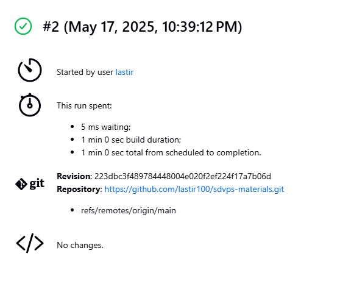
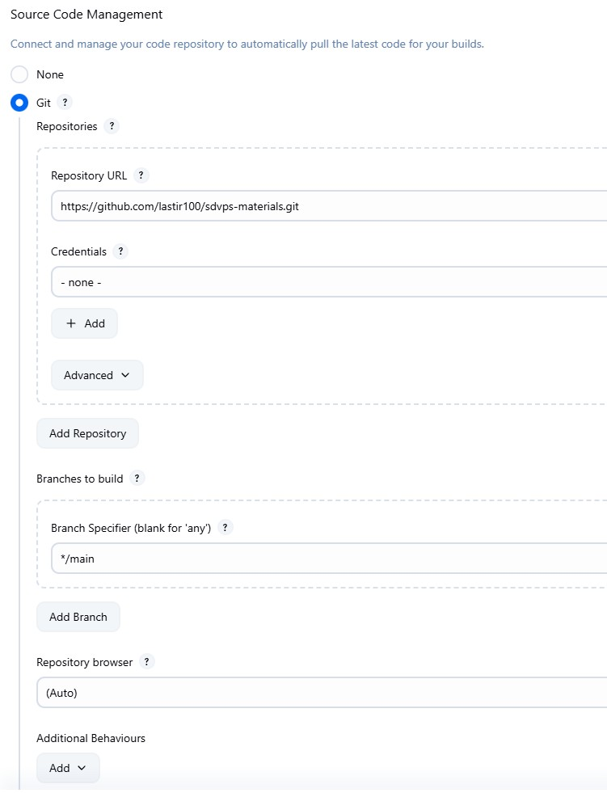
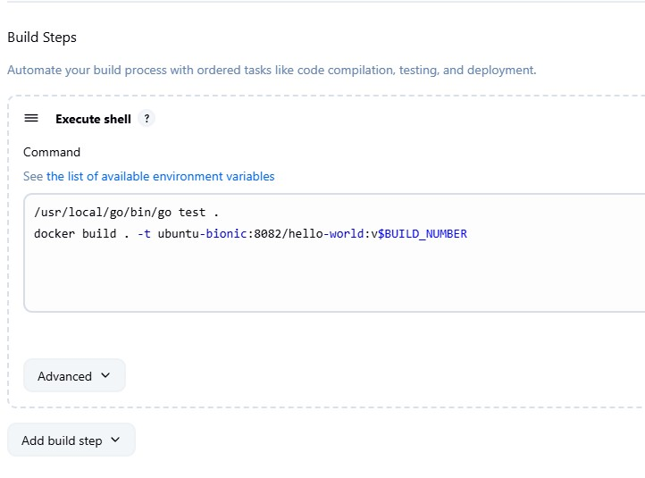
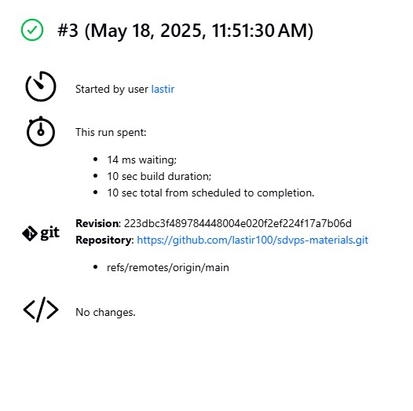
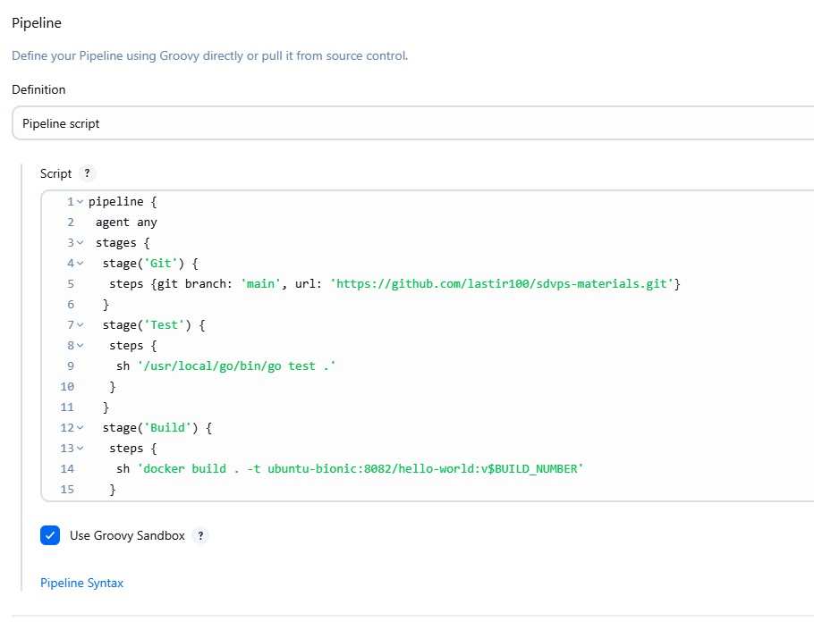
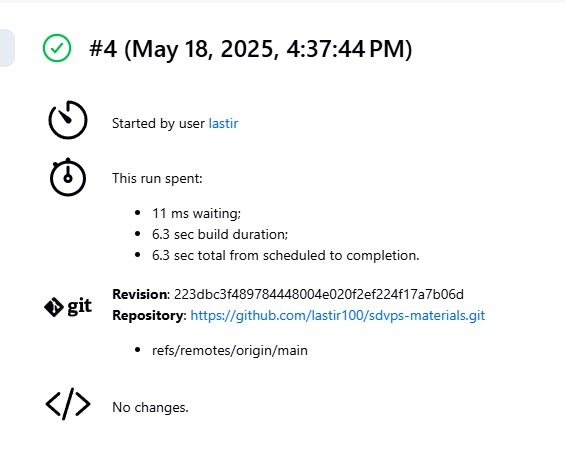
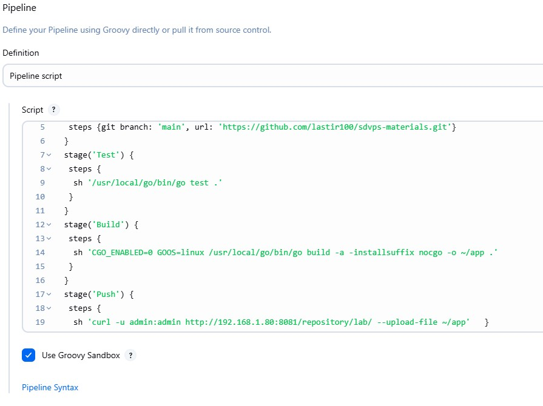

# Домашнее задание к занятию "`Что такое DevOps. СI/СD`" - `Минин Александр`

### Задание 1

**Что нужно сделать:**

1. Установите себе jenkins по инструкции из лекции или любым другим способом из официальной документации. Использовать Docker в этом задании нежелательно.
2. Установите на машину с jenkins [golang](https://golang.org/doc/install).
3. Используя свой аккаунт на GitHub, сделайте себе форк [репозитория](https://github.com/netology-code/sdvps-materials.git). В этом же репозитории находится [дополнительный материал для выполнения ДЗ](https://github.com/netology-code/sdvps-materials/blob/main/CICD/8.2-hw.md).
3. Создайте в jenkins Freestyle Project, подключите получившийся репозиторий к нему и произведите запуск тестов и сборку проекта ```go test .``` и  ```docker build .```.

В качестве ответа пришлите скриншоты с настройками проекта и результатами выполнения сборки.

### Решение 1
`

`

`
---

### Задание 2

**Что нужно сделать:**

1. Создайте новый проект pipeline.
2. Перепишите сборку из задания 1 на declarative в виде кода.

В качестве ответа пришлите скриншоты с настройками проекта и результатами выполнения сборки.

### Решение 2
`

`

```
pipeline {
 agent any
 stages {
  stage('Git') {
   steps {git branch: 'main', url: 'https://github.com/lastir100/sdvps-materials.git'}
  }
  stage('Test') {
   steps {
    sh '/usr/local/go/bin/go test .'
   }
  }
  stage('Build') {
   steps {
    sh 'docker build . -t ubuntu-bionic:8082/hello-world:v$BUILD_NUMBER'
   }
  }
 }
}
```
---

### Задание 3

**Что нужно сделать:**

1. Установите на машину Nexus.
1. Создайте raw-hosted репозиторий.
1. Измените pipeline так, чтобы вместо Docker-образа собирался бинарный go-файл. Команду можно скопировать из Dockerfile.
1. Загрузите файл в репозиторий с помощью jenkins.

В качестве ответа пришлите скриншоты с настройками проекта и результатами выполнения сборки.

### Решение 3
`

`

```
pipeline {
 agent any
 stages {
  stage('Git') {
   steps {git branch: 'main', url: 'https://github.com/lastir100/sdvps-materials.git'}
  }
  stage('Test') {
   steps {
    sh '/usr/local/go/bin/go test .'
   }
  }
  stage('Build') {
   steps {
    sh 'CGO_ENABLED=0 GOOS=linux /usr/local/go/bin/go build -a -installsuffix nocgo -o ~/app .'
   }
  }
  stage('Push') {
   steps {
    sh 'curl -u admin:admin http://192.168.1.80:8081/repository/lab/ --upload-file ~/app'   }
  }
 }
}
```

---
## Дополнительные задания* (со звёздочкой)

Их выполнение необязательное и не влияет на получение зачёта по домашнему заданию. Можете их решить, если хотите лучше разобраться в материале.

---

### Задание 4*

Придумайте способ версионировать приложение, чтобы каждый следующий запуск сборки присваивал имени файла новую версию. Таким образом, в репозитории Nexus будет храниться история релизов.

Подсказка: используйте переменную BUILD_NUMBER.

В качестве ответа пришлите скриншоты с настройками проекта и результатами выполнения сборки.

### Решение 4
`При необходимости прикрепитe сюда скриншоты
`
